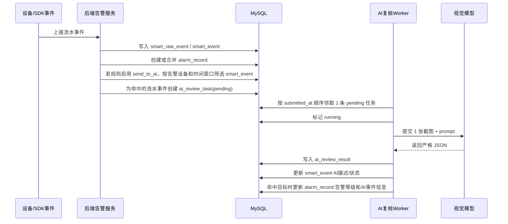

# 告警 AI 复核开发建议

本文档说明“生成告警后，对该告警关联的流水事件截图进行 AI 复核”的推荐实现方案。目标是让 AI 任务由系统自动产生、串行排队执行、每次只提交一张流水事件截图，并在复核命中目标结果时更新告警等级、记录 AI 复核信息和图片判断描述。

## 1. 结论建议

建议沿用现有智能事件链路：

- 流水事件使用 `smart_event`。
- 告警使用 `alarm_record`。
- AI 复核任务使用 `ai_review_task`。
- AI 复核结果使用 `ai_review_result`。

当前项目已经具备 `smart_event`、`alarm_record`、`ai_review_task`、`ai_review_result` 等表和查询接口，但现有 AI 任务更偏“提交记录 + 回调写结果”。本需求建议改造为“告警生成后自动入队 + 后端 Worker 主动调用视觉模型 + 结果回写告警和流水事件”。

核心原则：

1. 告警创建成功后再创建 AI 任务，任务必须先根据告警关联设备唯一定位系统设备，再按告警录像时间窗口筛选该设备的流水事件。
2. AI Worker 全局并发固定为 1，按提交时间顺序消费任务。
3. 每次模型请求只包含一张流水事件截图，禁止一次提交多图。
4. 模型返回必须是严格 JSON，后端只按 JSON 字段判定业务结果。
5. 复核命中目标结果后，按规则配置更新告警等级，并把流水事件信息写入告警 AI 事件信息，把模型图片描述写回流水事件。

## 2. 当前模型访问方式

根目录 `test.py` 展示的是 OpenAI Chat Completions 兼容接口，关键信息如下：

```text
POST http://192.168.1.116:8000/v1/chat/completions
model: Qwen3-VL-8B-Instruct
content: image_url(data:<mime>;base64,<image>) + text
max_tokens: 400
temperature: 0.4
timeout: 120s
```

后端实现时建议抽象为 `AiVisionClient`，不要把 `test.py` 的地址和模型名写死在业务代码中。推荐配置项：

```dotenv
AI_REVIEW_ENABLED=true
AI_REVIEW_API_URL=http://192.168.1.116:8000/v1/chat/completions
AI_REVIEW_MODEL=Qwen3-VL-8B-Instruct
AI_REVIEW_TIMEOUT_SECONDS=120
AI_REVIEW_MAX_TOKENS=800
AI_REVIEW_TEMPERATURE=0.1
AI_REVIEW_WORKER_CONCURRENCY=1
AI_REVIEW_MAX_RETRY=3
AI_REVIEW_DEFAULT_HIT_ALARM_LEVEL=high
```

`temperature` 建议低于当前 `test.py` 示例的 `0.4`，优先保证复核结果稳定。

## 3. 推荐业务流程



告警创建和任务创建建议放在同一事务中完成。模型调用不要放在告警创建事务内，避免外部 HTTP 慢调用阻塞告警落库。

## 4. 任务产生条件与流水事件筛选

在告警生成逻辑中，当满足以下条件时自动创建 AI 任务：

- 规则启用：`smart_binding_rule.send_to_ai = true`。
- 规则已选择 AI 复核方案：后台保存 `smart_binding_rule.ai_flow_code`，前端展示为“AI 复核方案”下拉选择，不建议让客户手工填写编码。
- 告警成功创建：优先只对新建告警创建任务。
- 告警能唯一定位设备：优先使用 `alarm_record.camera_id`，其次使用 `alarm_record.channel_id`，最后使用 `alarm_record.recorder_id`。同一告警不得匹配到多个候选设备。
- 告警有录像时间窗口：`alarm_record.record_start_time` 和 `alarm_record.record_end_time` 均非空。
- 能筛选到符合条件的流水事件，且流水事件存在截图：`smart_event.image_url` 非空。

流水事件筛选规则：

1. 先确认告警关联设备在系统中唯一。推荐优先级为 `camera_id > channel_id > recorder_id`：
   - 如果 `camera_id` 非空，按 `smart_event.camera_id = alarm_record.camera_id` 筛选。
   - 如果 `camera_id` 为空且 `channel_id` 非空，按 `smart_event.channel_id = alarm_record.channel_id` 筛选。
   - 如果前两者为空且 `recorder_id` 非空，按 `smart_event.recorder_id = alarm_record.recorder_id` 筛选；此时必须确认该录像机维度不会覆盖多个需要区分的通道，否则应拒绝自动复核并记录错误。
2. 使用告警录像时间计算 AI 复核窗口：
   - 开始时间：`ai_review_start_time = alarm_record.record_start_time + 30 秒`。
   - 结束时间：`ai_review_end_time = alarm_record.record_end_time - 90 秒`。
3. 按时间筛选流水事件：
   - `smart_event.event_time >= ai_review_start_time`。
   - `smart_event.event_time <= ai_review_end_time`。
4. 只选择有截图的流水事件：
   - `smart_event.image_url <> ''`。
5. 如果 `ai_review_start_time > ai_review_end_time`，说明告警录像窗口不足以形成有效 AI 复核区间，不创建任务，并记录原因。

推荐查询示例：

```sql
SELECT *
FROM smart_event
WHERE camera_id = :alarm_camera_id
  AND event_time >= DATE_ADD(:record_start_time, INTERVAL 30 SECOND)
  AND event_time <= DATE_SUB(:record_end_time, INTERVAL 90 SECOND)
  AND image_url IS NOT NULL
  AND image_url <> ''
ORDER BY event_time ASC, id ASC;
```

如果同一告警窗口内筛选到多条流水事件，建议为每条流水事件分别创建一条 `ai_review_task`。这样可以保持现有 `ai_review_task.smart_event_id` 的一对一关系，并满足“每次只向模型提交一张流水事件截图”的要求。

对合并告警的建议：

- 默认只对第一次新建告警创建 AI 复核任务，避免同一告警窗口内重复调用模型。
- 如业务需要“每次合并也复核”，应增加规则开关，例如 `ai_review_on_dedup_merge`，并限制同一告警的最大复核次数。

任务中必须固化以下信息到 `request_payload_json`，后续即使设备或告警被修改，也能追溯当时的复核上下文：

```json
{
  "alarm": {
    "id": 1001,
    "alarmNo": "ALM-20260706-0001",
    "alarmType": "移动侦测",
    "alarmLevel": "medium",
    "alarmTime": "2026-07-06T08:30:00+08:00"
  },
  "alarmReviewWindow": {
    "recordStartTime": "2026-07-06T08:29:30+08:00",
    "recordEndTime": "2026-07-06T08:32:30+08:00",
    "startOffsetSeconds": 30,
    "endOffsetSeconds": -90,
    "reviewStartTime": "2026-07-06T08:30:00+08:00",
    "reviewEndTime": "2026-07-06T08:31:00+08:00"
  },
  "smartEvent": {
    "id": 2001,
    "eventCode": "EVT-20260706-0001",
    "eventType": "motion_detect",
    "eventLevel": "medium",
    "eventTime": "2026-07-06T08:30:00+08:00"
  },
  "device": {
    "cameraId": 10,
    "cameraName": "1号门岗摄像机",
    "cameraCode": "CAM-001",
    "recorderId": 3,
    "channelId": 12,
    "channelNo": 1,
    "factoryId": 1,
    "zoneId": 2,
    "installLocation": "1号门岗"
  },
  "deviceMatch": {
    "matchField": "camera_id",
    "matchValue": 10,
    "unique": true
  },
  "image": {
    "url": "/media/snapshots/20260706/xxx.jpg",
    "mimeType": "image/jpeg"
  },
  "rule": {
    "aiFlowCode": "motion_person_review",
    "hitAlarmLevel": "high",
    "targetLabels": ["person", "intrusion"],
    "minConfidence": 0.7
  }
}
```

## 5. 队列与 Worker 设计

推荐新增 `AiReviewWorker`，服务启动时在 `bootstrap` 中启动一个后台 goroutine。由于需求明确“排队执行”，Worker 并发固定为 1。

领取任务建议：

1. 定时轮询 `ai_review_task` 中 `status = 'pending'` 的任务。
2. 按 `submitted_at ASC, id ASC` 排序。
3. 领取后立即更新为 `running`，记录本次执行时间。
4. 调用模型成功后写入 `ai_review_result`，任务状态改为 `done`。
5. 调用失败时递增 `retry_count`；未达到上限则改回 `pending`，达到上限则改为 `failed`。

MySQL 8 可以使用事务 + 行锁实现领取：

```sql
SELECT *
FROM ai_review_task
WHERE status = 'pending'
ORDER BY submitted_at ASC, id ASC
LIMIT 1
FOR UPDATE SKIP LOCKED;
```

如果暂时不使用 `SKIP LOCKED`，也可以用单实例 Worker + 事务更新保证最小可用。但如果未来部署多个后端实例，必须引入行锁、分布式锁或独立队列表。

## 6. 数据库改造建议

现有表可以支撑基础链路，但为满足“告警 AI 事件信息”和“流水事件图片描述”的要求，建议增加字段。

### 6.1 `ai_review_task`

建议新增：

```sql
ALTER TABLE ai_review_task
  ADD COLUMN alarm_id INTEGER NULL AFTER smart_event_id,
  ADD COLUMN image_url VARCHAR(500) NULL AFTER model_code,
  ADD COLUMN review_start_time DATETIME NULL AFTER image_url,
  ADD COLUMN review_end_time DATETIME NULL AFTER review_start_time,
  ADD COLUMN started_at DATETIME NULL AFTER submitted_at;
```

并增加索引：

```sql
CREATE INDEX ix_ai_review_task_alarm_id ON ai_review_task (alarm_id);
CREATE INDEX ix_ai_review_task_status_submitted_id ON ai_review_task (status, submitted_at, id);
```

`alarm_id` 用于明确任务属于哪一条告警，避免仅靠 `smart_event_id` 反查时出现一条事件关联多条告警的歧义。

`review_start_time` 和 `review_end_time` 用于固化本次任务筛选流水事件时使用的告警复核窗口，计算方式固定为：

- `review_start_time = alarm_record.record_start_time + 30 秒`。
- `review_end_time = alarm_record.record_end_time - 90 秒`。

### 6.2 `alarm_record`

建议新增：

```sql
ALTER TABLE alarm_record
  ADD COLUMN ai_event_info_json TEXT NULL AFTER push_records_json;
```

该字段记录命中复核时的流水事件信息、模型判定、命中规则和等级调整信息。例如：

```json
{
  "taskNo": "AIT-XXX",
  "smartEventId": 2001,
  "eventCode": "EVT-20260706-0001",
  "recordStartTime": "2026-07-06T08:29:30+08:00",
  "recordEndTime": "2026-07-06T08:32:30+08:00",
  "reviewStartTime": "2026-07-06T08:30:00+08:00",
  "reviewEndTime": "2026-07-06T08:31:00+08:00",
  "eventTime": "2026-07-06T08:30:20+08:00",
  "deviceMatch": {
    "matchField": "camera_id",
    "matchValue": 10
  },
  "imageUrl": "/media/snapshots/20260706/xxx.jpg",
  "decision": "hit",
  "hitLabels": ["person", "intrusion"],
  "confidence": 0.86,
  "oldAlarmLevel": "medium",
  "newAlarmLevel": "high",
  "imageDescription": "画面中可见一名人员进入监控区域。"
}
```

### 6.3 `smart_event`

建议新增：

```sql
ALTER TABLE smart_event
  ADD COLUMN ai_image_description TEXT NULL AFTER normalized_payload_json,
  ADD COLUMN ai_review_status VARCHAR(20) NULL AFTER ai_image_description,
  ADD COLUMN ai_review_task_id INTEGER NULL AFTER ai_review_status;
```

字段含义：

- `ai_image_description`：模型对该流水事件截图的中文图片描述。
- `ai_review_status`：`pending/running/hit/miss/uncertain/failed`。
- `ai_review_task_id`：最近一次复核任务。

如果希望少改表，也可暂时把图片描述写入 `smart_event.normalized_payload_json.aiReview.imageDescription`，但长期不建议这样做，因为列表查询和筛选不方便。

### 6.4 `smart_binding_rule`

建议新增 AI 复核配置：

```sql
ALTER TABLE smart_binding_rule
  ADD COLUMN ai_hit_alarm_level VARCHAR(20) NULL AFTER ai_flow_code,
  ADD COLUMN ai_target_labels_json TEXT NULL AFTER ai_hit_alarm_level,
  ADD COLUMN ai_min_confidence FLOAT NULL AFTER ai_target_labels_json;
```

配置含义：

- `ai_hit_alarm_level`：复核命中目标时，告警等级调整为何种等级。为空时使用全局默认值。
- `ai_target_labels_json`：业务想要的目标标签，例如 `["person", "intrusion"]`。
- `ai_min_confidence`：模型置信度低于该值时不提升告警等级。

### 6.5 AI 复核方案配置

`smart_binding_rule.ai_flow_code` 不建议作为客户手填字段。建议把它设计为“AI 复核方案”的稳定编码，由系统或管理员维护，客户在规则页面通过下拉框选择。

推荐新增配置表：

```sql
CREATE TABLE ai_review_flow (
  id INTEGER NOT NULL AUTO_INCREMENT,
  flow_code VARCHAR(60) NOT NULL,
  flow_name VARCHAR(100) NOT NULL,
  flow_version INTEGER NOT NULL,
  event_type VARCHAR(60),
  description VARCHAR(255),
  prompt_template TEXT NOT NULL,
  response_schema_json TEXT NOT NULL,
  response_mapping_json TEXT,
  target_labels_json TEXT NOT NULL,
  default_hit_alarm_level VARCHAR(20) NOT NULL,
  default_min_confidence FLOAT NOT NULL,
  model_code VARCHAR(60),
  enabled BOOL NOT NULL,
  sort INTEGER NOT NULL,
  created_at DATETIME NOT NULL DEFAULT now(),
  updated_at DATETIME NOT NULL DEFAULT now(),
  PRIMARY KEY (id),
  UNIQUE KEY uq_ai_review_flow_code (flow_code)
);
```

初始可内置几类常用方案：

| 复核方案名称 | `flow_code` | 目标标签示例 | 命中后默认等级 |
| --- | --- | --- | --- |
| 人员入侵复核 | `person_intrusion_review` | `["person", "intrusion"]` | `high` |
| 移动侦测人员复核 | `motion_person_review` | `["person"]` | `medium` |
| 安全帽佩戴复核 | `helmet_review` | `["helmet_missing"]` | `high` |
| 烟火复核 | `smoke_fire_review` | `["smoke", "fire"]` | `critical` |

绑定规则页面保存时：

- 前端展示 `flow_name`，提交 `flow_code`。
- 后端校验 `flow_code` 必须存在且启用。
- 规则中的 `ai_target_labels_json`、`ai_hit_alarm_level`、`ai_min_confidence` 可以默认从方案带出。
- 如果允许高级配置，可让管理员覆盖目标标签、命中等级、置信度、Prompt 模板和返回 JSON Schema；普通客户只选择方案和命中等级。
- 每次修改 Prompt 模板或返回 JSON Schema，建议生成新版本，例如 `flow_code = person_intrusion_review`，`flow_version = 2`。历史任务必须保留创建时使用的版本信息。

不建议的交互：

- 不建议显示“AI 流程编码”文本输入框。
- 不建议要求客户填写 `person_intrusion_review` 这类英文编码。
- 不建议让客户直接编辑完整 prompt，除非是管理员高级页面。

### 6.6 返回 JSON 配置权限

返回 JSON 的格式和内容可以开放给高级管理员维护，但不建议开放给普通客户直接编辑。

推荐权限分层：

| 角色 | 可配置内容 | 不建议开放内容 |
| --- | --- | --- |
| 普通客户/普通管理人员 | 选择 AI 复核方案、命中告警等级、最低置信度、查看模型返回 JSON | 直接编辑 Prompt、直接编辑返回 JSON Schema |
| 高级管理员/系统管理员 | Prompt 模板、返回 JSON Schema、字段映射、目标标签、默认等级、置信度、方案启停和版本 | 删除系统必需核心字段 |

系统必须强制保留以下核心字段，否则后端无法稳定判断结果和回写数据：

```json
{
  "decision": "hit | miss | uncertain",
  "labels": ["person"],
  "confidence": 0.86,
  "imageDescription": "图片描述",
  "reason": "判断理由"
}
```

高级管理员可以新增业务字段，例如：

```json
{
  "personCount": 1,
  "helmetStatus": "missing",
  "dangerArea": true,
  "smokeAreaRatio": 0.12
}
```

但新增字段只能作为扩展信息写入 `ai_review_result.result_payload_json` 或 `alarm_record.ai_event_info_json`，告警是否命中仍以核心字段和规则配置为准。

推荐 `response_schema_json` 示例：

```json
{
  "type": "object",
  "required": ["decision", "labels", "confidence", "imageDescription", "reason"],
  "properties": {
    "decision": {
      "type": "string",
      "enum": ["hit", "miss", "uncertain"]
    },
    "labels": {
      "type": "array",
      "items": { "type": "string" }
    },
    "confidence": {
      "type": "number",
      "minimum": 0,
      "maximum": 1
    },
    "imageDescription": {
      "type": "string"
    },
    "reason": {
      "type": "string"
    },
    "evidence": {
      "type": "array"
    },
    "riskLevelSuggestion": {
      "type": "string",
      "enum": ["low", "medium", "high", "critical"]
    }
  },
  "additionalProperties": true
}
```

推荐 `response_mapping_json` 示例：

```json
{
  "decisionPath": "$.decision",
  "labelsPath": "$.labels",
  "confidencePath": "$.confidence",
  "imageDescriptionPath": "$.imageDescription",
  "reasonPath": "$.reason",
  "evidencePath": "$.evidence",
  "riskLevelSuggestionPath": "$.riskLevelSuggestion"
}
```

保存高级配置时，后端必须校验：

- `response_schema_json` 是合法 JSON。
- `required` 中包含 `decision`、`labels`、`confidence`、`imageDescription`、`reason`。
- `decision` 枚举必须包含且只能使用 `hit/miss/uncertain`。
- `confidence` 必须是 0 到 1 的数字。
- `response_mapping_json` 中核心字段路径不能为空。
- 保存前提供“测试 Prompt/JSON”按钮，使用一张样例图验证模型返回是否能被解析。

## 7. Prompt 建议

Prompt 应尽量固定、短、可解析，并明确只基于图片判断。设备、时间等上下文用于任务审计，不要求模型推断。

推荐文本：

```text
你是安防告警复核助手。请只根据用户提供的一张监控截图进行判断，不要臆测截图外的信息。

复核目标：
- 判断截图中是否出现需要确认告警的目标行为或目标对象。
- 当前目标标签包括：{{targetLabels}}。
- 如果图片不清晰、遮挡严重、无法确认，请返回 decision = "uncertain"。

事件上下文：
- 设备名称：{{deviceName}}
- 设备编码：{{deviceCode}}
- 安装位置：{{installLocation}}
- 事件类型：{{eventType}}
- 告警录像开始时间：{{recordStartTime}}
- 告警录像结束时间：{{recordEndTime}}
- AI复核筛选开始时间：{{reviewStartTime}}
- AI复核筛选结束时间：{{reviewEndTime}}
- 当前流水事件时间：{{eventTime}}

返回要求：
- 只返回一个 JSON 对象。
- 不要使用 Markdown。
- 不要输出 JSON 以外的解释。
- labels 只能填写你从图片中确认的标签。
- imageDescription 用中文简要描述图片内容。

默认 JSON 格式：
{
  "decision": "hit | miss | uncertain",
  "labels": ["person"],
  "confidence": 0.0,
  "imageDescription": "中文图片描述",
  "reason": "中文判断理由",
  "evidence": [
    {
      "label": "person",
      "description": "画面中部可见人员轮廓",
      "bbox": [0.12, 0.20, 0.50, 0.80]
    }
  ],
  "riskLevelSuggestion": "low | medium | high | critical"
}
```

默认 JSON 格式由 AI 复核方案中的 `response_schema_json` 约束。高级管理员可以在方案高级配置中增加业务字段，但必须保留 `decision`、`labels`、`confidence`、`imageDescription`、`reason` 这 5 个核心字段。

业务判定建议：

- `decision = hit` 且 `confidence >= ai_min_confidence`，认为复核命中。
- `decision = miss`，认为未命中，不调整告警等级，可记录为 AI 未确认。
- `decision = uncertain`，不调整告警等级，但保留描述和原因，方便人工复核。
- `riskLevelSuggestion` 只作为参考，不直接覆盖系统配置的等级。

## 8. 模型请求格式

后端请求模型时，仍使用 OpenAI 兼容格式。每次只放一张图：

```json
{
  "model": "Qwen3-VL-8B-Instruct",
  "messages": [
    {
      "role": "user",
      "content": [
        {
          "type": "image_url",
          "image_url": {
            "url": "data:image/jpeg;base64,/9j/..."
          }
        },
        {
          "type": "text",
          "text": "<上文prompt>"
        }
      ]
    }
  ],
  "max_tokens": 800,
  "temperature": 0.1
}
```

图片来源建议：

1. 使用筛选命中的 `smart_event.image_url`。
2. 不建议用 `alarm_record.image_url` 代替流水事件截图，因为本需求要求“每次只向模型提交一张流水事件截图”。如果流水事件无截图，应跳过该流水事件并记录原因。
3. URL 为本地媒体路径时，后端读取文件并转为 base64 data URL。
4. URL 为 HTTP 地址时，后端下载图片后转为 base64 data URL，并设置下载超时和大小上限。

建议限制：

- 单图最大 5MB。
- 仅允许 `image/jpeg`、`image/png`。
- HTTP 图片下载超时不超过 10 秒。
- 模型调用超时使用 `AI_REVIEW_TIMEOUT_SECONDS`。

## 9. 模型返回 JSON 格式

标准返回是默认模板，高级管理员可通过 `ai_review_flow.response_schema_json` 和 `response_mapping_json` 扩展字段，但核心字段必须保留。

默认返回：

```json
{
  "decision": "hit",
  "labels": ["person", "intrusion"],
  "confidence": 0.86,
  "imageDescription": "画面中可见一名人员进入监控区域，背景为厂区通道。",
  "reason": "截图中存在清晰人员轮廓，位置处于监控区域内，符合入侵复核目标。",
  "evidence": [
    {
      "label": "person",
      "description": "画面左侧到中部可见人员轮廓",
      "bbox": [0.28, 0.18, 0.54, 0.82]
    }
  ],
  "riskLevelSuggestion": "high"
}
```

字段约束：

| 字段 | 类型 | 必填 | 说明 |
| --- | --- | --- | --- |
| `decision` | string | 是 | 只能是 `hit`、`miss`、`uncertain` |
| `labels` | string[] | 是 | 模型确认的目标标签 |
| `confidence` | number | 是 | 0 到 1 |
| `imageDescription` | string | 是 | 写回流水事件的图片描述 |
| `reason` | string | 是 | 判断理由 |
| `evidence` | array | 否 | 证据说明，可含 bbox |
| `riskLevelSuggestion` | string | 否 | 模型建议等级，仅作参考 |

扩展字段建议：

- 与业务强相关的结构化字段可以加入，例如 `personCount`、`helmetStatus`、`dangerArea`。
- 扩展字段必须通过 JSON Schema 校验。
- 扩展字段默认只进入 `result_payload_json` 和 `ai_event_info_json`，不得绕过核心字段直接决定告警等级。

后端解析时要做防御：

- 如果模型返回 Markdown 代码块，先提取其中 JSON。
- 如果 JSON 解析失败，任务标记失败并记录原始返回。
- 如果 `decision` 不在枚举内，按失败处理。
- 如果 `confidence` 缺失或越界，按 `uncertain` 处理。
- 如果返回 JSON 不符合当前方案版本的 `response_schema_json`，任务标记失败或按 `uncertain` 处理，具体策略由方案配置决定。

## 10. 结果回写规则

模型结果落库建议在一个事务中完成：

1. 写入 `ai_review_result`：
   - `decision` 写模型决策。
   - `labels_json` 写 `labels`。
   - `confidence` 写置信度。
   - `reason` 写判断理由。
   - `evidence_json` 写 `evidence`。
   - `result_payload_json` 写完整模型 JSON 和原始响应。

2. 更新 `ai_review_task`：
   - 成功：`status = done`，`finished_at = now()`。
   - 未命中也属于成功，只是 `decision = miss`。
   - 失败：按重试策略更新 `status/retry_count/error_message`。

3. 更新 `smart_event`：
   - `ai_image_description = imageDescription`。
   - `ai_review_status = hit/miss/uncertain/failed`。
   - `ai_review_task_id = task.id`。

4. 命中目标时更新 `alarm_record`：
   - `ai_review_task_id = task.id`。
   - `alarm_level = smart_binding_rule.ai_hit_alarm_level`，为空则使用全局默认等级。
   - `ai_event_info_json` 写入流水事件和 AI 结果摘要。
   - 建议新增一条 `alarm_process_log`，记录由 AI 复核调整告警等级。

不建议让模型直接决定告警等级。模型可以给 `riskLevelSuggestion`，但最终等级必须来自规则配置或全局配置。

## 11. 后端开发落点

建议新增或调整的代码位置：

- `internal/config/config.go`：增加 AI 模型配置项。
- `internal/service/ai_review_worker.go`：新增 Worker，负责领取任务、读取图片、调用模型、回写结果。
- `internal/service/ai_vision_client.go`：新增 OpenAI 兼容视觉模型客户端。
- `internal/service/platform_smart_service.go`：扩展 `SubmitSmartAIReview`，支持 `alarm_id`、图片和时间窗口。
- `internal/service/hikvision_alarm_bridge_service.go`：在新告警创建成功后，根据告警设备唯一性和 `RecordStartTime + 30 秒` 到 `RecordEndTime - 90 秒` 的窗口筛选流水事件，再根据规则自动创建 AI 任务。
- `internal/domain/entity/models.go`：补充新增字段。
- `sql/init_database.sql`：同步新字段和索引。
- `deploy_ubuntu.sh`：给存量环境增加字段和索引补丁。

任务创建建议封装为独立方法：

```go
func (s *PlatformService) CreateAlarmAIReviewTasks(
    tx *gorm.DB,
    alarm entity.AlarmRecord,
    rule entity.SmartBindingRule,
) ([]entity.AiReviewTask, error)
```

该方法内部负责：

1. 按告警字段确认唯一设备。
2. 计算 `reviewStartTime = RecordStartTime + 30 秒`。
3. 计算 `reviewEndTime = RecordEndTime - 90 秒`。
4. 查询时间窗口内的流水事件。
5. 为每条有截图的流水事件创建一条 AI 任务。

这样手动提交和自动提交可以复用同一套任务构造逻辑，避免 prompt 和 request payload 分叉。

## 12. 前端展示建议

在“智能接口 / AI 集成”或告警详情中展示：

- 绑定规则配置时，将“送 AI”设计为开关；开启后显示“AI 复核方案”下拉框。
- “AI 复核方案”选项来自 `ai_review_flow`，展示 `flow_name`，保存 `flow_code` 到 `smart_binding_rule.ai_flow_code`。
- 选择方案后自动带出目标标签、命中后告警等级、最低置信度；普通客户只调整告警等级和置信度，管理员可进入高级配置维护方案。
- 高级配置页面允许系统管理员维护 Prompt 模板、返回 JSON Schema、字段映射和方案版本；保存前必须提供测试按钮，验证样例图返回 JSON 能通过校验。
- 普通客户可以查看模型返回 JSON，但不提供直接编辑 JSON Schema 的入口。
- AI 任务状态：待执行、执行中、已复核、失败。
- AI 判定：命中、未命中、不确定。
- 图片描述：来自 `smart_event.ai_image_description`。
- 告警 AI 事件信息：来自 `alarm_record.ai_event_info_json`。
- 等级调整记录：展示旧等级、新等级、任务号和时间。

告警列表可增加筛选：

- AI 复核状态。
- 是否 AI 命中。
- 是否由 AI 调整等级。

## 13. 验收清单

- [ ] 规则开启 `send_to_ai` 后，新建告警自动产生 `ai_review_task`。
- [ ] 创建任务前会确认告警关联设备在系统中唯一；无法唯一定位时不创建任务并记录原因。
- [ ] 流水事件筛选窗口使用 `alarm_record.record_start_time + 30 秒` 到 `alarm_record.record_end_time - 90 秒`。
- [ ] 任务 `request_payload_json` 中包含告警设备、录像时间、AI 复核筛选时间、流水事件时间和图片地址。
- [ ] Worker 同一时间只执行一个模型请求。
- [ ] 每次模型请求只包含一张图片。
- [ ] 模型返回 `hit` 且置信度达标时，告警等级调整为配置等级。
- [ ] 模型返回 `miss` 或 `uncertain` 时，不调整告警等级。
- [ ] 高级管理员可以维护返回 JSON Schema 和字段映射，但无法删除核心字段。
- [ ] 修改 Prompt 或 JSON Schema 后会形成新版本，历史任务仍能追溯旧版本配置。
- [ ] AI 复核方案提供样例图测试按钮，测试不通过时不允许启用方案。
- [ ] 告警记录写入 `ai_event_info_json`。
- [ ] 流水事件写入 AI 图片描述。
- [ ] 模型调用失败会重试，超过上限后任务进入失败状态。
- [ ] 图片不存在、下载失败、JSON 解析失败都有明确错误信息。
- [ ] 人工重试任务不会重复创建多条无关联结果。

## 14. 风险与注意事项

- 模型输出不稳定：必须强制 JSON，并做严格枚举校验。
- 图片路径不可访问：Worker 应支持本地媒体路径读取，不要依赖浏览器可访问 URL。
- 重复复核：告警合并场景要避免短时间内重复创建任务。
- 多实例部署：如果后端部署多个实例，需要行锁或分布式锁保证串行领取。
- 等级覆盖：模型建议等级不能直接覆盖业务配置等级。
- 敏感信息：不要把设备账号、密码、内网密钥写入 prompt 或 `request_payload_json`。
