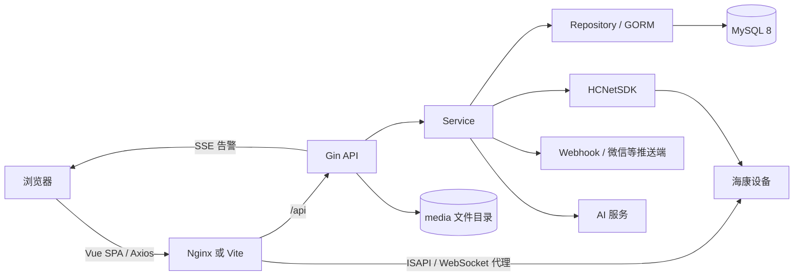

# 架构与代码说明

## 1. 总体架构

后端采用实用型分层结构。读取类公共查询集中在 `QueryService + Repository`，大量平台写操作和设备编排集中在 `PlatformService`。这不是严格的领域驱动架构，service 中允许直接使用 GORM。

## 2. 后端启动与生命周期

`cmd/server/main.go` 的流程如下：

1. 解析项目根目录。
2. `bootstrap.Build` 加载 `.env` 与系统环境变量。
3. 创建 Zap production logger。
4. 建立 GORM/MySQL 连接，连接池为最大空闲 5、最大打开 20、连接最长 30 分钟。
5. 构造 Repository、AuthService、QueryService、PlatformService。
6. 创建并启动 `HikvisionAlarmBridgeService`。启动失败只记录 warning，不阻止 HTTP 服务。
7. 创建 Gin 路由、CORS、静态媒体挂载和 JWT 中间件。
8. 监听 HTTP；收到 Ctrl+C/SIGTERM 后给 HTTP 服务 10 秒优雅停机，并停止告警桥接。

## 3. 后端分层职责

| 层 | 职责 | 约束 |
|---|---|---|
| `config` | 从 `.env`/环境变量读取配置，创建媒体目录 | `MYSQL_DSN` 必填 |
| `database` | MySQL 连接与池配置 | 无自动迁移，结构由 SQL 脚本维护 |
| `entity` | GORM 表映射 | 字段名显式映射，表名由 `TableName` 指定 |
| `dto` | 登录、用户信息、列表返回结构 | 平台 service 仍有较多 `map[string]any` |
| `repository` | 用户/RBAC、基础资料、设备、告警、首页查询 | 负责复杂 join 与过滤 |
| `service` | 校验、事务、设备调用、告警/推送/AI 编排 | `platform_service.go` 较大，扩展时宜拆分 |
| `handler` | HTTP 参数解析、状态码、调用 service | 不承载核心业务 |
| `router` | 路由注册、CORS、静态目录、认证边界 | 当前没有后端接口级权限中间件 |
| `integration/hikvision` | Windows/Linux SDK 封装和非支持平台 stub | Linux 使用 CGO/C++ bridge |

## 4. 认证与 RBAC

- 登录查询 `sys_user`，支持 bcrypt 及 Django 风格 `pbkdf2_sha256` 密码哈希。
- JWT claims 包含 `user_id`、`username` 和标准过期时间，默认有效期 1440 分钟。
- 受保护接口使用 `Authorization: Bearer <token>`。
- `AuthService.GetMe` 聚合用户、角色、菜单、按钮权限和数据范围。
- 菜单树来自 `sys_menu` 与 `sys_role_menu`；按钮权限来自 `sys_permission` 与 `sys_role_permission`。
- `safety-data-items`、`monitor-config` 两个菜单代码在查询中被隐藏。
- 当前 Router 只校验 JWT，不按 permission_code 拒绝具体 API；前端的 `v-permission` 和权限 store 主要承担可见性控制。

## 5. 核心业务链路

### 5.1 海康移动侦测到告警

1. 告警桥接服务读取启用的智能绑定和摄像机/NVR 凭据。
2. 使用 HCNetSDK 登录设备、注册回调并布防。
3. SDK 回调被转换为 `MotionAlarm`，按设备和通道定位数据源。
4. 事件进入约 2 秒的聚合窗口，执行规则匹配、置信度/时间计划、去重与冷却判断。
5. 保存 `smart_raw_event` 和标准化后的 `smart_event`。
6. 根据规则生成或合并 `alarm_record`，保存图片/录像引用并触发推送或 AI 复核。
7. 前端通过 `/api/sse/alarms?token=...` 接收实时刷新信号，再拉取告警列表。

### 5.2 智能接口与 AI 复核

- Provider 描述外部智能来源、认证方式和连接信息。
- Capability 描述事件能力，如移动侦测或 AI 分析。
- Binding 将 Provider/Capability 绑定到 camera、recorder 或 channel。
- Rule 决定告警级别、去重、冷却、抓图、录像、推送、AI 复核和是否直接生成告警。
- 外部事件写入 raw event 后标准化为 smart event。
- AI 任务进入 `ai_review_task`，回调写入 `ai_review_result`，随后更新事件/告警状态。

### 5.3 视频预览与回放

- 后端根据 camera/channel 和码流参数生成 RTSP 或 WebControl 配置。
- 前端提供普通视频播放器和海康 WebControl 播放组件。
- Vite 开发服务器代理 `/ISAPI`、`/SDK` 和 `/webSocketVideoCtrlProxy`；生产 Nginx 必须提供对应代理与跨源隔离头。
- 录像搜索、定位、停止和按时间下载由 HCNetSDK 执行；下载结果保存到媒体目录。

## 6. 前端架构

| 目录 | 说明 |
|---|---|
| `src/api` | 按业务域封装 Axios 请求 |
| `src/views` | 登录、首页、主数据、设备、监控、告警、推送、系统页面 |
| `src/components/video` | HLS/海康 WebControl 播放组件与宫格 |
| `src/services/realtime` | 告警 SSE 客户端 |
| `src/stores` | Pinia 的 auth、permission、realtime、app 状态 |
| `src/router` | 静态路由及登录守卫 |
| `src/directives` | 按钮权限指令 |
| `src/styles` | token、基础、组件和页面样式 |

Axios 默认 API 根地址为 `VITE_API_BASE_URL`，未设置时为 `http://127.0.0.1:8000/api`。token 保存在 localStorage 的 `steel-monitor-access-token`；401 会清 token 并跳转登录页。

## 7. 新功能开发建议流程

1. 在 SQL 增加表/索引/初始化数据，同时在 entity 添加映射。
2. 在 service 定义明确的请求/返回 DTO，避免继续扩大 `map[string]any`。
3. 在 repository 封装可复用查询；跨多表写操作使用事务。
4. 在 handler 解析并校验 path/query/body，统一用 response 包返回。
5. 在 router 注册路由，并补充后端权限检查。
6. 前端增加 `src/api/<domain>.ts`、页面和路由；菜单路由名需与 `sys_menu.route_name` 一致。
7. 补单元测试、API 集成测试；设备功能另做真机测试。
8. 同步更新本目录文档和 SQL 初始化脚本。
