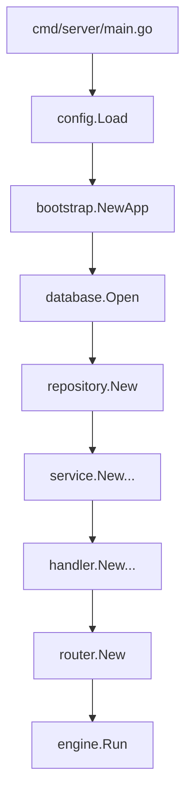
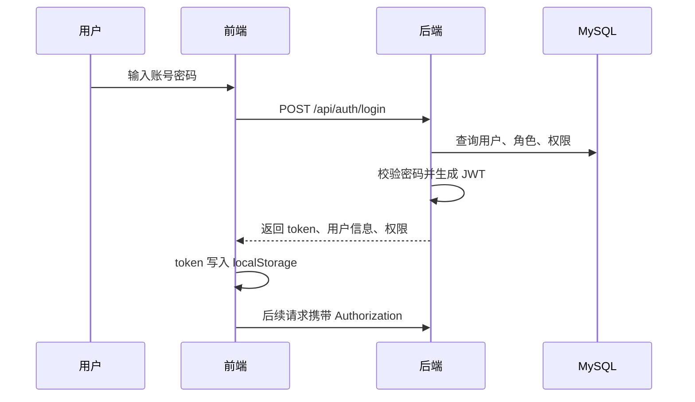
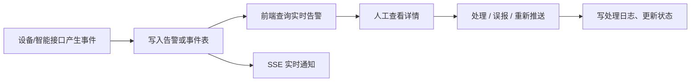

# 后端模块开发文档

本文档说明 Go 后端的模块划分、代码入口、核心职责与扩展方式。后端采用 Gin + GORM + MySQL + JWT，整体按“入口初始化、HTTP 层、服务层、仓储层、领域模型、外部集成”组织。

## 1. 后端目录职责

| 目录 | 职责 |
| --- | --- |
| `cmd/server` | 服务启动入口，负责定位项目根目录、加载配置、初始化应用并启动 HTTP 服务。 |
| `internal/config` | 读取 `.env` 与环境变量，生成运行配置。 |
| `internal/bootstrap` | 组装数据库、仓储、服务、处理器、路由等依赖。 |
| `internal/database` | MySQL/GORM 连接初始化。 |
| `internal/http/router` | Gin 路由注册、CORS、静态资源挂载、鉴权分组。 |
| `internal/http/handler` | HTTP 入参解析、响应封装、状态码处理。 |
| `internal/http/middleware` | JWT 鉴权中间件。 |
| `internal/http/response` | 统一响应结构。 |
| `internal/service` | 业务逻辑编排。 |
| `internal/repository` | 数据访问封装。 |
| `internal/domain/entity` | GORM 实体模型。 |
| `internal/domain/dto` | 请求与响应 DTO。 |
| `internal/integration/hikvision` | 海康 SDK 适配，包含 Windows、Linux 与 stub 实现。 |
| `internal/util` | JWT、密码、设备密钥等通用工具。 |

## 2. 启动生命周期



启动时必须提供 `MYSQL_DSN`。配置加载成功后，程序会确保 `MEDIA_ROOT_DIR` 存在，并把 `MEDIA_MOUNT_PATH` 映射为静态资源路径。

## 3. 认证与菜单模块

代码位置：

- `internal/http/handler/auth_handler.go`
- `internal/service/auth_service.go`
- `internal/util/jwt.go`
- `internal/util/password.go`

主要能力：

- 用户登录：`POST /api/auth/login`
- 用户退出：`POST /api/auth/logout`
- 当前用户信息：`GET /api/auth/me`
- 当前用户菜单：`GET /api/menus`

认证流程：



当前实现要点：

- 密码使用 `internal/util/password.go` 封装校验与哈希。
- JWT 中间件只负责识别登录态。
- 后端目前未对每个接口做权限点级别拦截，页面和按钮权限主要由前端控制。

生产建议：

- 补充接口级 RBAC 中间件。
- 对登录失败次数、弱密码、默认密码进行限制。
- `JWT_SECRET_KEY` 必须替换默认值。

## 4. 基础资料模块

涉及对象：

- 厂区：`FactoryArea`
- 区域：`FactoryZone`
- 部门：`SysDept`
- 字典类型：`SysDictType`
- 字典项：`SysDictItem`

主要接口：

- `GET /api/factories`
- `POST /api/factories`
- `PUT /api/factories/:id`
- `PATCH /api/factories/:id/status`
- `DELETE /api/factories/:id`
- 区域、部门、字典接口采用类似模式。

模块特点：

- 查询接口放在 `QueryHandler`，供多个页面复用。
- 写操作放在 `PlatformHandler`。
- 状态启停使用 `PATCH /status`，物理删除或逻辑删除需以代码和数据库约束为准。

扩展建议：

- 新增基础资料时，优先复用“列表查询 + 新增 + 编辑 + 状态变更 + 删除”的接口模式。
- 字典类字段应优先通过字典表配置，不建议在前端硬编码。

## 5. 设备管理模块

涉及对象：

- 摄像机：`CameraDevice`
- 录像机：`RecorderDevice`
- 录像机通道：`RecorderChannel`
- 设备状态日志：`DeviceStatusLog`

主要能力：

- 摄像机、录像机 CRUD。
- 设备连接测试。
- 设备状态检测。
- 录像机通道同步。
- 摄像机 SDK 配置读取与修改。
- PTZ 预置点、变焦、用户等 SDK 控制。

核心接口示例：

| 能力 | 接口 |
| --- | --- |
| 摄像机详情 | `GET /api/cameras/:id` |
| 摄像机连接测试 | `POST /api/cameras/:id/test` |
| 摄像机状态检测 | `POST /api/cameras/:id/status/check` |
| 摄像机 SDK 配置 | `GET /api/cameras/:id/sdk-config` |
| 录像机通道同步 | `POST /api/recorders/:id/sync-channels` |
| 全量设备状态检测 | `POST /api/devices/status/check-all` |

设备密钥：

- 设备密码、推送密钥、智能接口密钥使用 `internal/util/device_secret.go` 做加密处理。
- 如果 `DEVICE_SECRET_KEY` 未配置，部分场景会保留兼容旧明文数据的能力，但生产环境必须配置。

## 6. 海康 SDK 集成模块

代码位置：

- `internal/integration/hikvision/sdk_windows.go`
- `internal/integration/hikvision/sdk_linux.go`
- `internal/integration/hikvision/sdk_stub.go`
- `internal/integration/hikvision/runtime.go`

实现方式：

- Windows 和 Linux 分别使用 build tags 选择对应 SDK 实现。
- 无 SDK 或不支持平台时，stub 实现用于保持编译可用。
- Linux 侧包含 C++ bridge 文件。

部署风险：

- 代码默认 Linux 路径为 `third_party/HCNetSDK_Linux64`。
- 仓库、Dockerfile、默认配置和 `LD_LIBRARY_PATH` 已统一引用 `HCNetSDK_Linux64`。
- Linux 文件系统大小写敏感，发布前仍需确认服务器上的 `HIKVISION_SDK_PATH` 和实际目录名一致。

## 7. 告警模块

涉及对象：

- 告警记录：`AlarmRecord`
- 处理日志：`AlarmProcessLog`
- 推送日志：`AlarmPushLog`

主要能力：

- 实时告警查询：`GET /api/alarms/realtime`
- 历史告警查询：`GET /api/alarms`
- 告警详情：`GET /api/alarms/:id`
- 告警处理：`POST /api/alarms/:id/process`
- 标记误报：`POST /api/alarms/:id/false-alarm`
- 重新推送：`POST /api/alarms/:id/repush`
- 实时推送：`GET /api/sse/alarms?token=<JWT>`

告警处理流程：



SSE 注意事项：

- 浏览器 `EventSource` 不能设置自定义 `Authorization` 头。
- 当前实现通过 query 参数传 `token`。
- 生产环境建议仅在 HTTPS 下使用，并控制 token 生命周期。

## 8. 推送模块

涉及对象：

- 推送配置：`PushConfig`
- 推送日志：`AlarmPushLog`

主要能力：

- 推送配置 CRUD。
- 推送通道测试。
- 推送日志查询。
- 推送失败重试。

接口：

- `GET /api/push/configs`
- `POST /api/push/configs`
- `PUT /api/push/configs/:id`
- `PATCH /api/push/configs/:id/status`
- `POST /api/push/configs/:id/test`
- `GET /api/push/logs`
- `POST /api/push/logs/:id/retry`

开发建议：

- 新增推送渠道时，优先在服务层抽象 provider，不要把不同渠道的 HTTP 细节散落在 handler。
- 推送请求应记录请求摘要、响应状态、失败原因和重试次数。

## 9. 智能接口与 AI 事件模块

涉及对象：

- 智能接口厂商：`SmartInterfaceProvider`
- 智能能力：`SmartInterfaceCapability`
- 设备绑定：`SmartDeviceBinding`
- 绑定规则：`SmartBindingRule`
- 原始事件：`SmartRawEvent`
- 标准事件：`SmartEvent`
- AI 复核任务：`AiReviewTask`
- AI 复核结果：`AiReviewResult`

主要能力：

- 智能接口配置。
- 能力与设备绑定。
- 厂商事件接入。
- 原始事件与标准事件查询。
- AI 复核任务提交、查询、重试。
- AI 回调处理。

关键接口：

- `POST /api/smart/events/ingest/:providerCode`
- `POST /api/smart/events/:id/submit-ai-review`
- `POST /api/smart/ai/callback`
- `POST /api/ai/events/callback`

当前约束：

- `/api/smart/events/ingest/:providerCode` 和 `/api/smart/ai/callback` 当前注册在 JWT 保护分组下。
- 如果第三方系统无法携带平台 JWT，需要调整路由分组，并改用签名、密钥、IP 白名单或 mTLS 等方式保护。

## 10. 视频模块

主要能力：

- 实时预览。
- WebControl 配置获取。
- 抓图。
- 录像检索。
- 回放地址获取。
- 回放拖动。
- 录像下载。
- 停止预览/回放。

接口示例：

- `GET /api/video/live/:id`
- `GET /api/video/live/channel/:id`
- `GET /api/video/live/:id/webcontrol-config`
- `POST /api/video/snapshot`
- `GET /api/video/playback/search`
- `GET /api/video/playback/url`
- `GET /api/video/playback/download`

前后端协作点：

- 后端负责生成可访问的播放地址或 SDK/WebControl 所需参数。
- 前端播放器组件位于 `frontend/src/components/video`。
- 录像下载可能产生临时文件，应关注 `MEDIA_ROOT_DIR` 容量和清理策略。

## 11. 报表与导出模块

接口：

- `GET /api/reports/alarms`
- `GET /api/reports/devices`
- `GET /api/reports/push`
- `GET /api/export/alarms`
- `GET /api/export/device-status`
- `GET /api/export/push-logs`

说明：

- 报表接口返回统计数据。
- 导出接口返回文件流，前端通过 `downloadFile` 解析 `Content-Disposition` 文件名并下载。

## 12. 新增后端能力的推荐步骤

以“新增巡检记录模块”为例：

1. 在 `sql/init_database.sql` 增加表结构和必要索引。
2. 在 `internal/domain/entity/models.go` 增加实体。
3. 在 `internal/domain/dto/dto.go` 增加请求与响应结构。
4. 在 `internal/repository/repository.go` 增加数据访问方法。
5. 在 `internal/service` 增加业务逻辑。
6. 在 `internal/http/handler` 增加 handler。
7. 在 `internal/http/router/router.go` 注册路由。
8. 在 `docs/api.md` 与本模块文档中补接口说明。
9. 增加必要单元测试或接口回归用例。

提交前检查：

```powershell
go test ./...
```

如前端也改动：

```powershell
cd frontend
npm run build
```
